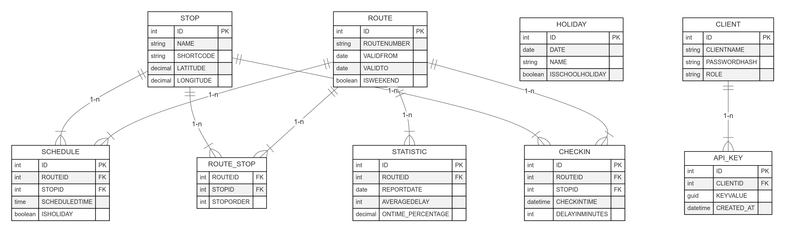

# README

## 1. Für welches Datenmodell haben Sie sich entschieden? (ER-Diagramm, eventuelle Besonderheiten erläutern)

Wir verwenden ein relationales Datenmodell mit folgenden **Kernelementen**:

- **ROUTE**: Enthält Informationen zu Bus- bzw. Linienrouten (ID, Routennummer, Gültigkeitszeitraum, ob Wochenendroute, …).
- **STOP**: Beschreibt Haltestellen (ID, Name, Geokoordinaten, Shortcode, …).
- **ROUTE_STOP** (m:n-Abbildung zwischen `ROUTE` und `STOP`): Bestimmt die Reihenfolge, in der eine Route bestimmte Stops anfährt.
- **SCHEDULE**: Hinterlegt Fahrpläne (RouteID, StopID, geplante Uhrzeit). Hier kann man angeben, ob es sich um Feiertagsfahrplan handelt.
- **HOLIDAY**: Liste von Feiertagen und Schulferien (Datum, Name, isSchoolHoliday).
- **CHECKIN**: Speichert Echtzeit-Ankünfte (Check-ins) von Bussen (Zeitpunkt, RouteID, StopID, Delay).
- **API_KEY**: Enthält erlaubte API-Keys (GUID) mit Verknüpfung zu Clients.
- **CLIENT** (optional): Benutzertabelle für Admins/Operatoren mit Rollen, PasswordHash etc.

**Besonderheiten**:
- Wir erfassen Verspätungen in `CHECKIN.Delayinminutes`, wobei die Differenz zur im `SCHEDULE` hinterlegten Plan-Abfahrtszeit bestimmt wird.
- In `SCHEDULE` kann ein Eintrag ein `IsHoliday = 1` haben, falls die Zeit nur an Feiertagen gilt.



---

## 2. Dokumentieren Sie auf Request-Ebene den gesamten Workflow anhand eines möglichst durchgängigen Beispiels

**Beispiel-Workflow**: „Einpflegen von Haltestellen und Feiertagen, Planung einer Route, Durchführung einer Fahrt, Check-in“

1. **Haltestellen (STOP) anlegen**
    - `POST /api/STOP` mit JSON `{ "name": "Hagenberg", "shortcode": "HGB", "latitude": ..., "longitude": ... }`.
    - Antwort: `201 Created` mit neuer ID.

2. **Feiertage hinzufügen**
    - `POST /api/HOLIDAY` mit JSON `{ "date": "2024-12-25", "name": "Weihnachten", "isschoolholiday": false }`.
    - Antwort: `200 OK` oder `201 Created`.

3. **Route planen**
    - `POST /api/ROUTE` mit JSON `{ "routenumber": "R1", "validfrom": "2024-01-01", "validto": "2024-12-31", "isweekend": false, "stops": [...] }`.
    - Hier können wir die Haltestellen-Liste mit Reihenfolge angeben.

4. **Fahrplanzeiten erstellen (SCHEDULE)**
    - `POST /api/SCHEDULE` oder je nach Implementierung erfolgt es über die `RouteWithStop`-Struktur.
    - Enthält `(routeid, stopid, scheduledtime, isholiday)`.

5. **Durchführung einer Fahrt (Check-in)**
    - Der Bus funkt die Ankunft an einer Haltestelle via `POST /api/CHECKIN`.
        - Body (Beispiel):
          ```json
          {
            "API_KEY": "7567e610-c41e-4530-a35d-1d0daccce286",
            "routeId": 1,
            "stopId": 5,
            "dateTime": "2024-12-22T07:35:00Z"
          }
          ```
    - Daraufhin wird geprüft, ob (a) der API_KEY gültig ist, (b) Route & Stop existieren, (c) ob es ein Feiertag ist, und (d) Verspätung berechnet.
    - Erfolgsantwort: `200 OK` mit `"Delay: 5 minutes"`.

**Tools**:
- **Postman** oder **VS Code REST Client** für die HTTP-Requests.
- **HTTP-Verben**: `GET`, `POST`, `PUT`, `DELETE` je nach Ressource.
- **Body**: JSON,
- **Header**: `Content-Type: application/json`, ggf. `Authorization: Bearer <token>`.

---

## 3. Wie stellen Sie sicher, dass das Einchecken der Busse nur mit einem gültigen API-Key möglich ist?

- In unserem `CheckInConnector` wird per SQL-Abfrage `SELECT COUNT(1) FROM API_KEY WHERE Keyvalue = @API_KEY` geprüft, ob der übermittelte API_KEY in der DB existiert.
- Kommt `0` zurück, wird `Unauthorized("Invalid API key")` zurückgegeben.
- Zusätzlich sichern wir (falls gewünscht) den Endpoint noch mit **Keycloak** (`[Authorize]` + JWT-Token). So wird ein doppelter Schutz erreicht.

---

## 4. Ein Angreifer hat Zugriff auf ein Datenbank-Backup Ihres Produktivsystems bekommen. Welchen Schaden kann er anrichten?

- **Mögliche Schäden**:
    1. Er erhält **API_KEY**-GUIDs und könnte so – sofern kein Keycloak aktiv ist – unbefugt Check-ins fälschen.
    2. Er sieht alle **Fahrplandaten** (SCHEDULE, ROUTE).
    3. Er sieht ggf. **Benutzerdaten** (CLIENT).
    4. Bei unzureichend gehashten Passwörtern könnte er Accounts kompromittieren.

- **Gegenmaßnahmen**:
    - **Verschlüsselung** der DB-Backups (TDE, AES, etc.).
    - **Passwörter / Secrets** nie im Klartext speichern.
    - **API_KEY**-Rotation**: Falls ein Dump entwendet wird, kann man neue Keys generieren.

---

## 5. Bei welchen Teilen Ihres Systems ist eine korrekte Funktionsweise am kritischsten? Welche Maßnahmen haben Sie getroffen?

- **Kritische Teile**:
    1. **CheckIn**: Verspätungen sollen korrekt berechnet werden, sonst entstehen falsche Betriebsdaten.
    2. **SCHEDULE** / **ROUTE**: Routen & Fahrpläne müssen stimmen, sonst sind sämtliche Fahrgast-Infos fehlerhaft.

- **Maßnahmen**:
    - **Unit- und Integrationstests** für Kernlogik (z. B. Verspätungsberechnung).
    - **Validierung** und Constraints in der DB (Foreign Keys).
    - **Logging & Monitoring** (z. B. bei Unstimmigkeiten Warnungen).

---

## 6. Wie haben Sie die Berechnung passender Routen bei Fahrplanabfragen modular umgesetzt? Welche Teile Ihres Codes müssten Sie ändern, um eine andere Variante einzusetzen?

- Die **Routensuche** erfolgt in einem separaten Connector/Service (z. B. `ConnectionConnector`).
- **Direkte Verbindungen** werden via `JOIN SCHEDULE s1, s2` in SQL realisiert.
- Verbindungen mit **max. 1 Umstieg** kombinieren Start→Mitte und Mitte→Ziel in C#.
- **Modularität**: Man kann hier später ein Graph-Algorithmus (Dijkstra/A*) einbauen, ohne die restlichen Endpoints zu ändern, weil die Controllerschicht nur den Service aufruft.

---

## 7. Welche Prüfungen führen Sie bei einem Check-in (der Standortdaten eines Busses) durch, um die Korrektheit der Daten zu gewährleisten?

1. **API_KEY** existiert
2. **Route & Stop** existieren in `SCHEDULE`
3. Prüfen, ob Datum = `HOLIDAY` → `IsHoliday = 1` oder 0
4. **Verspätungsberechnung**: Vergleichen von Planzeit vs. IST-Zeit
5. **Zeit-Fenster**: Wir erlauben nur Check-ins, wenn die Zeit realistisch ist (optional, z. B. nicht 12h in der Vergangenheit).
6. **Insertion** in DB nur, wenn obige Checks bestanden.

---

## 8. Wie stellen Sie sicher, dass Ihre API auch in außergewöhnlichen Konstellationen (Jahreswechsel, Zeitumstellung, Feiertag in den Schulferien, etc.) stets korrekte Fahrplandaten liefert?

- **Zeitumstellung**: Falls wir mit **UTC**-Zeit arbeiten und `DateTimeOffset`/`TimeSpan` sauber handhaben, umgehen wir viele Probleme.
- **Feiertag + Schulferien**: In `SCHEDULE` ist ein Attribut `IsHoliday`. In `HOLIDAY`-Tabelle steht, wann `IsSchoolHoliday = 1`. Wir checken ggf. in der Query, ob wir den korrekten Fahrplan ziehen.
- **Tests**: Spezielle Testfälle für z. B. 29.02. (Schaltjahr) oder 2:30 Uhr am Tag der Umstellung.

---

## 9. Bei der Übertragung eines API-Keys auf einen Bus ist etwas schiefgelaufen, der Bus liefert mangels gültiger Authentifizierung keine Check-in-Daten mehr. Wie erkennen und kommunizieren Sie das Problem?

- **Erkennung**:
    - Der Bus-Backend kann ggf. den Status melden („Invalid API Key“).

- **Kommunikation**:
    - Log-Einträge (z. B. `Unauthorized: Invalid API key`).
    - Falls wir ein zentrales Dashboard haben, könnte es einen Alarm auslösen.

- **Lösung**:
    - API-Key neu verteilen oder Key im DB-Backend neu generieren.

---

## 10. Denken Sie an die Skalierbarkeit Ihres Projekts: Die Wiener Linien möchten Ihr Produkt mit über 1.000 Fahrzeugen nutzen. Was macht Ihnen am meisten Kopfschmerzen?

- **Größere Datenmengen** an Check-ins pro Tag:
    - Brauche ich **Indexierung** auf `CHECKIN(RouteId, StopId, Checkintime)`?
    - Brauche ich horizontales Scaling?
- **Redis**/**In-Memory**-Caching für Fahrplan-Daten, damit das System bei vielen Abfragen performant bleibt.
- **Lastverteilung** (Load Balancer), um eingehende Requests zu verteilen.
