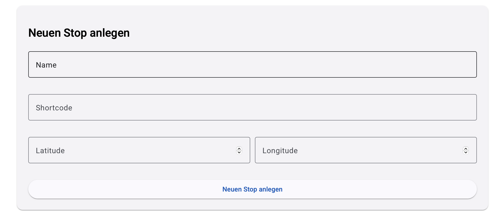
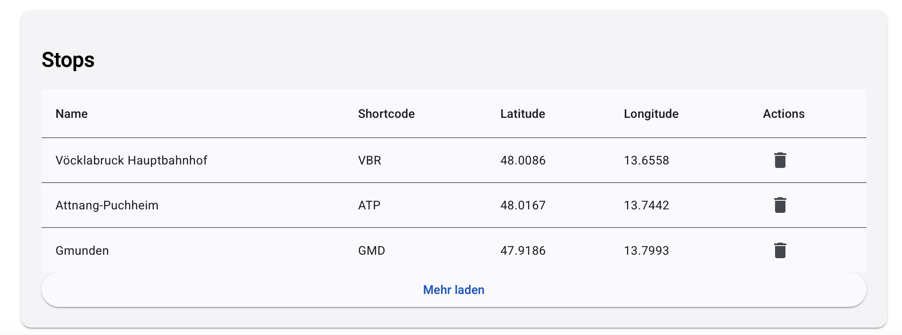
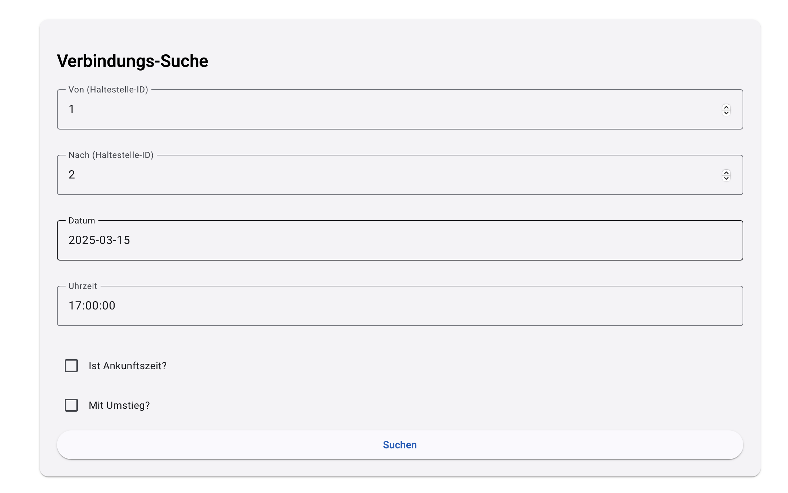
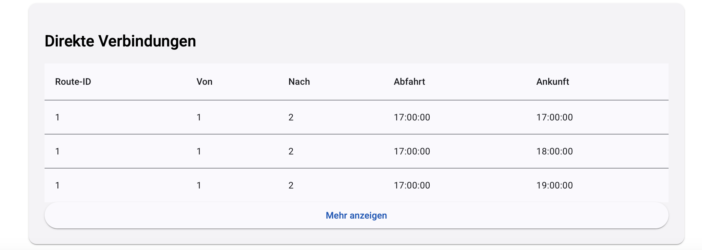
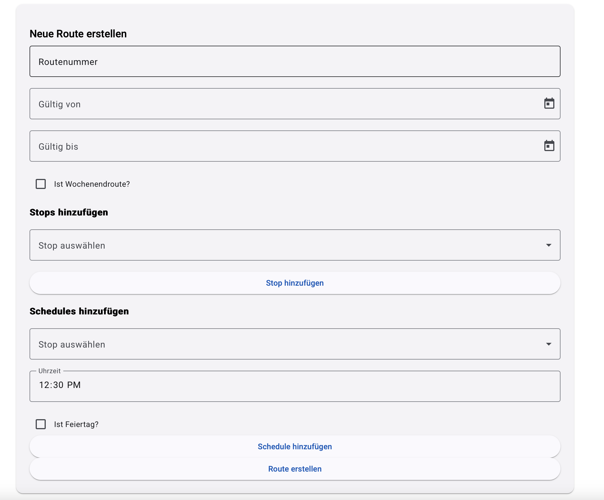
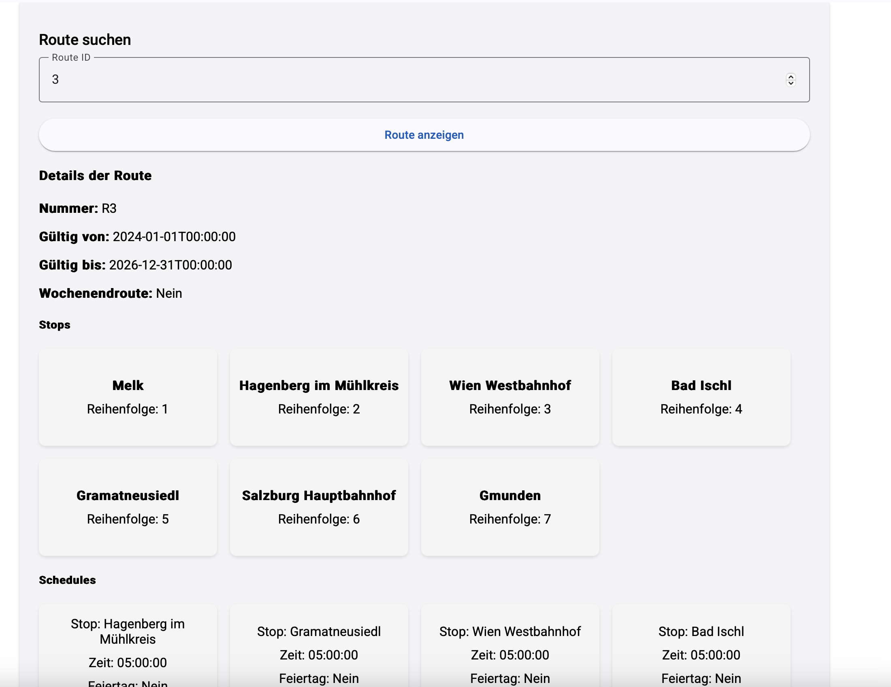

**Dokumentation des Frontends (WEA5)**

---

### Inhaltsverzeichnis

1. Einleitung
2. Architektur des Projekts
   - Komponentenbaum
   - Zusammenhang von Services mit Komponenten
   - Wichtige Komponenten
3. Navigationswege
4. Testlauf der Anwendung
5. Fragen
   - a. Umgang mit Änderungen der URLs
   - b. Schutz bestimmter Seiten nach Login
   - c. Sicherstellung der korrekten Dateneingabe
   - d. Umgang mit Backend-Fehlern
6. Setup der Anwendung
7. Externe Bibliotheken und Komponenten
8. Nicht implementierte Features

---

### 1. Einleitung

Das WEA5-Frontend ist eine Angular-basierte Anwendung, die mehrere Funktionalitäten bietet:
- Verwaltung von Haltestellen, Feiertagen, Verbindungen, Routen und Statistiken.
- Authentifizierung mittels OAuth2.
- Dynamische Datenabfragen und Übersicht durch Angular Material Design.

Ziel dieser Dokumentation ist es, die Architektur, Navigationswege und technischen Details der Anwendung zu beschreiben, sodass neue Entwickler sich schnell zurechtfinden.

---

### 2. Architektur des Projekts

#### Komponentenbaum

```plaintext
AppComponent
  ├── MatToolbarModule (Header)
  ├── MatTabsModule (Navigation Tabs)
  ├── RouterOutlet (Content-Bereich)
  ├── StopsListComponent (Verwaltung von Haltestellen)
  ├── HolidaysListComponent (Verwaltung von Feiertagen)
  ├── ConnectionsListComponent (Verbindungs-Suche)
  ├── RoutesListComponent (Routen-Management)
  └── StatisticsListComponent (Statistiken)
```

#### Zusammenhang von Services mit Komponenten

1. **StopsService**:
   - Genutzt von `StopsListComponent` zur Verwaltung von Haltestellen (Erstellen, Suchen, Löschen).

2. **HolidaysService**:
   - Genutzt von `HolidaysListComponent` zur Verwaltung von Feiertagen (Erstellen, Anzeigen, Löschen).

3. **ConnectionsService**:
   - Genutzt von `ConnectionsListComponent` zur Suche nach direkten und komplexen Verbindungen.

4. **RoutesService**:
   - Genutzt von `RoutesListComponent` zur Verwaltung von Routen (Erstellen, Laden von Details und Stops).

5. **StatisticsService**:
   - Genutzt von `StatisticsListComponent` zur Abfrage und Visualisierung von Verspätungsstatistiken.

6. **AuthenticationService**:
   - Von allen Guard-geschützten Komponenten genutzt, um den Login-Status zu prüfen.

#### Wichtige Komponenten

- **AppComponent**:
  - Hauptkomponente, die die Navigation über Tabs und den Router steuert.

- **StopsListComponent**:
  - Zuständig für die Anzeige und Verwaltung von Haltestellen.

- **HolidaysListComponent**:
  - Zuständig für die Verwaltung von Feiertagen.

- **RoutesListComponent**:
  - Ermöglicht das Management von Routen, Stops und Fahrplänen.

- **StatisticsListComponent**:
  - Visualisiert Statistiken wie Pünktlichkeitsquoten.

---

### 3. Navigationswege

#### Übersicht (Diagramm):

```plaintext
+-------------------------+
|          Login          |
+-----------+-------------+
            |
+-----------v-------------+
|    Navigation (Tabs)    |
|                         |
| - Feiertage             |
| - Haltestellen          |
| - Verbindungen          |
| - Routen                |
| - Statistik             |
+-----------+-------------+
```

Die Navigation erfolgt über Angular Router und ist in `app.routes.ts` definiert. Jede Tab-Route ist über Lazy Loading implementiert.

#### Details zu den Tabs
- **Feiertage** (`/holidays`):
  - Liste aller Feiertage mit Möglichkeit, neue Feiertage hinzuzufügen oder zu löschen.

- **Haltestellen** (`/stops`):
  - Suchen, Anzeigen und Erstellen von Haltestellen.

- **Verbindungen** (`/connections`):
  - Direkte und komplexe Verbindungen zwischen Haltestellen suchen.

- **Routen** (`/routes`):
  - Verwaltung von Routen und zugehörigen Stops.

- **Statistik** (`/statistics`):
  - Visualisierung von Verspätungsstatistiken.

---

### 4. Testlauf der Anwendung

#### Szenario: Erstellung eines neuen Stops
1. Navigiere zu **Haltestellen**.
2. Fülle das Formular aus (Name, Shortcode, Koordinaten).
3. Klicke auf "Neuen Stop anlegen".



#### Szenario: Suche nach direkten Verbindungen
1. Navigiere zu **Verbindungen**.
2. Gib Start- und Ziel-Haltestelle sowie Zeit ein.
3. Wähle ggf. "Mit Umstieg?".
4. Klicke auf "Suchen".



#### Szenario: Erstellung einer neuen Route
1. Navigiere zu **Routen**.
2. Gib Routenummer und Gültigkeitszeitraum ein.
3. Füge Stops und Fahrpläne hinzu.
4. Klicke auf "Route erstellen".



---

### 5. Fragen

#### a. Umgang mit Änderungen der URLs
- URLs sind zentral in `app.routes.ts` definiert. Änderungen erfordern Anpassungen nur an dieser Stelle.
- Da die Komponenten Lazy Loading nutzen, ist der Eingriff minimal invasiv.

#### b. Schutz bestimmter Seiten nach Login
- Guards wie `canNavigateToAdminGuard` überprüfen den Login-Status mit `AuthenticationService.isLoggedIn()`.
- Nicht eingeloggte Benutzer werden auf den Login-Flow umgeleitet.

#### c. Sicherstellung der korrekten Dateneingabe
- **Frontend**:
  - Angular Material Form Controls stellen sicher, dass nur gültige Eingaben akzeptiert werden.
  - Beispiel: `mat-form-field` validiert Typ und Format.
- **Backend**:
  - API prüft Daten nochmals (z. B. Zahlenbereiche, Pflichtfelder).

#### d. Umgang mit Backend-Fehlern
- Fehlerbehandlung erfolgt über Angular's `HttpClient`.
- Fehler werden in der Konsole geloggt oder den Benutzern angezeigt.
- Verbesserungsmöglichkeit: Implementierung eines globalen Error-Handlers.

---

### 6. Setup der Anwendung

#### Voraussetzungen
1. **Node.js** und **Angular CLI**
2. Ein OAuth2-Server (z. B. Keycloak).

#### Installation
```bash
npm install
ng serve
```

#### Backend
- Das Backend muss unter `http://localhost:5213` laufen.

#### Authentifizierung
- Keycloak ist unter `http://localhost:8080` konfiguriert.

---

### 7. Externe Bibliotheken und Komponenten

1. **Angular Material**:
   - UI-Komponenten wie Toolbar, Tabs, Tabellen und Formulare.

2. **Angular OAuth2 OIDC**:
   - Authentifizierung und Token-Management.

3. **Chart.js**:
   - Visualisierung von Statistiken.

4. **RxJS**:
   - Reaktive Programmierung und API-Handling.

---

### 8. Nicht implementierte Features

1. **Backend-Validierung**: Nur grundlegende Validierungen.
2. **Dynamische Statistiken**: Der Statistik-Tab zeigt keine komplexen Analysen.
3. **Testabdeckung**: Keine Unit- oder Integrationstests implementiert.